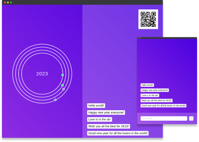

# Countdown Chat App



This application is a simple app built with NodeJS, Express, MongoDB and Socket.io.

The purpose of this application is only for learning purposes to explore the possiblities of Socket.io.

## How to run the app
```bash
git clone https://github.com/jeromehaas/countdown-chat-app.git
cd countdown-chat-app
nvm use
npm install
npm run dev
```

* Don' forget to setup a MongoDb database and to setup the `.env` file.